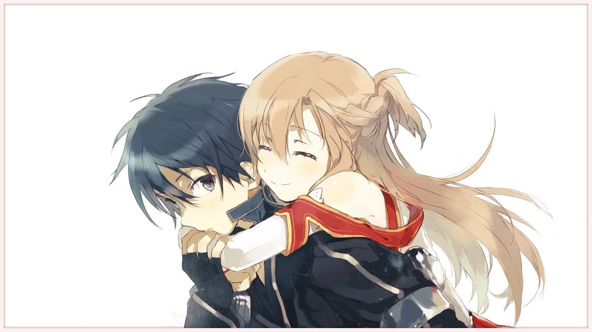

  

Anime Music Videos are steadily increasing in popularity, and at the moment, has an audience that reaches multimillions. An Anime Music Video, or AMV for short, is an edit of an anime series where clips throughout the series are showcased and sliced up to match a song. The posibilites with AMVs are endless, but what makes a top tier AMV is the storytelling process.

For this project, I seamlessly worked between Adobe studio's software and uploaded it to YouTube. This project was crafted in Adobe After Effects, Adobe Premiere Pro, Adobe Audition, and Adobe Photoshop. The first two software deals with the actual video editing process, Audition was used to finetune the audio icluding audible effects. Lastly, Photoshop was used to create the thumbnail.

The art of editing is a continuous struggle, however with every edit I make, I finetune my craft and pick up new editing techniques along the way. One of the greatest improvements I have picked up through this experience, was the art of story telling. By choosing certain clips, I was able to guide the viewer through a storyline, and provoke emotions in this "short story".

You can view the full video at [YouTube](https://youtu.be/sUrCzR5ECbM).

