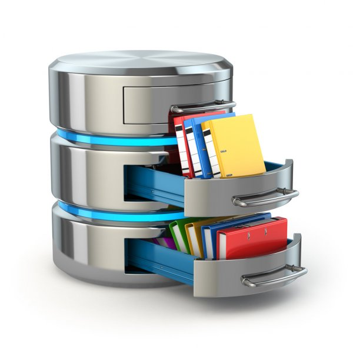

This is a project issued in the ICS212 course offered at UH Manoa. Firstly, a bank interface was created for a banker to use when working with people. The interface would prompt the user to enter their data, then multiple options would be shown for the banker to use. Some of these options included an add record, find record, print record, delete record, and quit function.

The entire project was coded in C, on unix in vim. As this is the first C project I have ever coded, I learned many things not only through the project, but also in the process of learning C. I've only coded in Java before, so learning how C works and its pointers, really opened my mind up to the endless posibilities. I also got a deeper understanding of how Java works, as we learned more about ASCII and binary throughout this project.

 
More information can be found on the courses website: (http://www2.hawaii.edu/~tidota/212s21/#%F0%9F%93%92-assignments)
