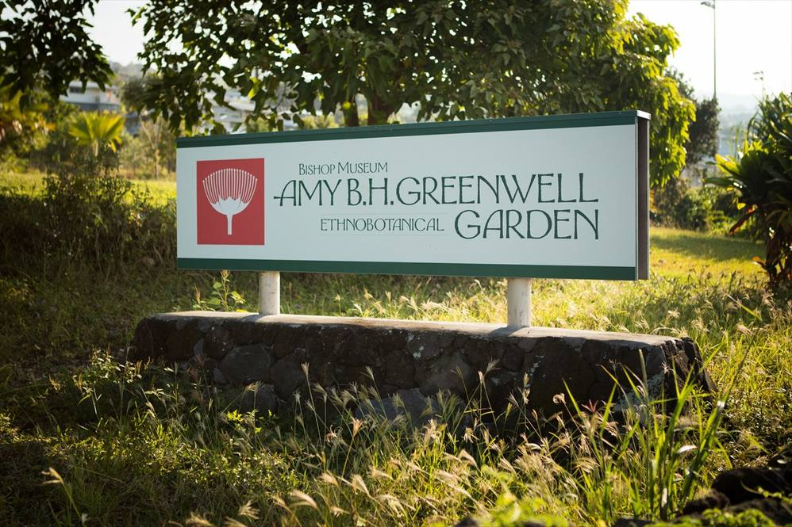

This garden houses more than 200 indigenous native Hawaiian plant species, on its vast 13 acres. Many of which are rare and endangered.
There are many duties to be done at the garden, and there is only one official worker there now. A few of the many duties that I have been tasked with include, surveying for invasive fire ants, weed and pest managemenet, continuing native agricultural practices, and assisting modern activies and research on sacred sites.

Every year, I return home during the summer and put in Community Service hours at Greenwell Ethnobotanical Garden. I work there
5 days a week, 4 days in the week from 8 to 3, and one day on the weekend. Every Saturday, the "friends" (volunteer members) get together from 9 to 12:30 and work on the garden.

I grew up on my grandparent's farm, where I assisted them with maintaining the farm. I am very much used to this type of work, 
and it is very satisfying to help out the man that works here alone. I've also learned how to drive manual transmition from
this man, where he taught me to drive the farm truck around the garden. I have gained invaluable experience, and more than anything a humbling perspective on life.

Link to the garden's website: (https://www.amygreenwell.garden/)

