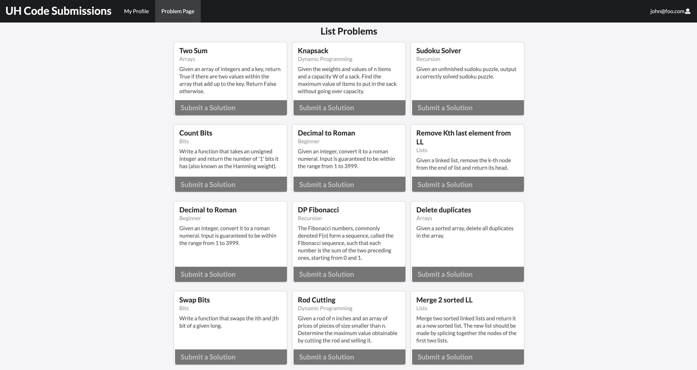
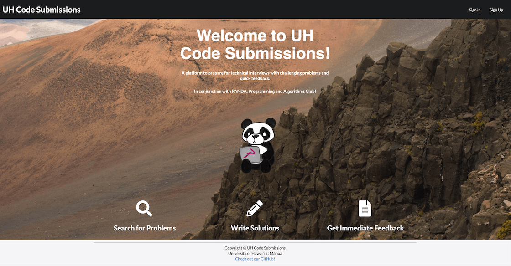
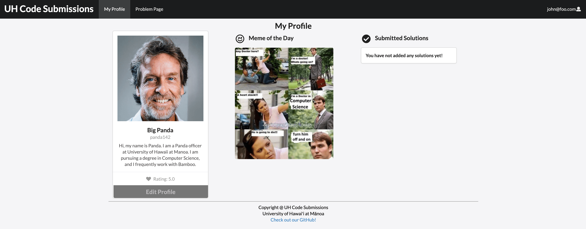

My final project for ICS 314 at UH Manoa, was creating a website designed for the use of the PANDA club to assist teaching algorithms to UH Manoa students using interview-like problems. This comprehensive website stores problems and solutions submitted by students and allows the admins to administer new problems and review student’s solutions.

Our website features a landing time that welcomes you with a lovely little panda. You are required to sign up if you have not already registered or sign in with your existing account. The profile page is where you can configure your own profile and add a fun bio as well. You can also see on this page, your previously submitted solutions. Lastly there is a meme of the day, so you open the site with a smile. The other tab is the problems page where you can choose your cause of death. We have problems ranging from frightening to ominous. However, with enough practice hopefully you can fly through these problems with ease one day.

Our GitHub page has a list of all our features, and even community feedback. We value hearing from the community so we can create an app that is effective and loved by all. This app was also specifically designed for use by the PANDA club, so we have been in close contact with their president to ensure a successful product.

For this project we used an issue driven project management, where we listed out issues to be addressed and carried out our project step by step. I first worked created mockup pages as ideas to what our actual site should look like and feature. From there we began to build a database of profiles and problems to be stored. This project proved to be quite difficult and there were aspects of subscribing to data that were everlasting. This was really an eye opening experience though, and learning how to work

Source code for this project can be found [here](https://github.com/uh-code-submissions/uh-code-submissions).

Link to the project's development website can be found [here](https://uh-code-submissions.github.io/)

